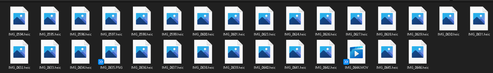
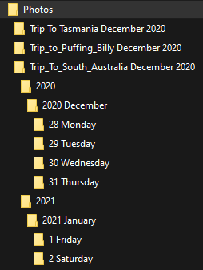

# iOS Photo Sorter
A python script that utilizes exiftool to sort any given images in to folders and categories.

## ***Previous***

## ***After sort***

Inputs given:

Topic = Trip_To_South_Australia

Results Path = D:/Photos

Images Path = D:/iPhoneSharedFolder

***
## Table Of Contents
* [Requirements](#Requirements)
* [Important Info](#Information)
***
## Requirements
* A working [Vanilla Python 3.7.4](https://www.python.org/downloads/release/python-374/) installation.

* Exiftool can be [downloaded from here](https://exiftool.org/).

* PC running windows 10 OS.

***
## Information

* This program is designed to handle images that has been ideally shot by an Apple Device.

* All content that is parsed by the program ***has to be*** of the following file formats. Feel free to fork and change the source code to accomodate more formats at your own risk.

>heic/HEIC

>jpeg/JPEG

>jpg/JPG

>mov/MOV

>png/PNG

>mp4/MP4

* I am not liable for any losses that could occur through the use of my program. I have tested it to the best of my abilities but as a highschool student , i donot posses the firmware to test multiple systems.

* Data loss is a very real possiblity so i recommend backing up before letting my program sort your photos

* I dont know how to make my program handle spaces in file paths. Feel free to open up a pull request if you know how to implement this
